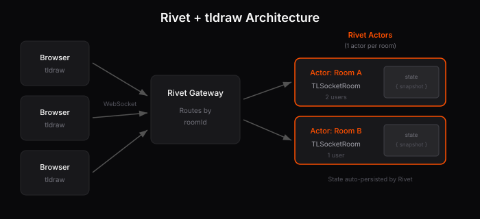

# tldraw sync with Rivet

Real-time multiplayer for [tldraw](https://tldraw.dev) powered by [Rivet](https://rivet.gg) actors.

## What's included

- **Real-time collaboration** - Multiple users can draw on the same canvas simultaneously
- **Automatic persistence** - Room state is saved automatically by Rivet
- **Scalable architecture** - Each room runs in its own actor instance
- **Asset storage ready** - Hooks for uploading images and videos (bring your own storage)
- **Bookmark previews** - URL metadata fetching for link shapes

## Architecture

<p align="center">
  
</p>

Each tldraw room maps to a Rivet actor. When users join a room:

1. **Browser** → Connects to the **Rivet Gateway** via WebSocket
2. **Gateway** → Routes the connection to the appropriate **Actor** based on room ID
3. **Actor** → Runs `TLSocketRoom` from `@tldraw/sync-core`, managing document state
4. **State** → Actor state (snapshots) is automatically persisted by Rivet

Changes are broadcast instantly to all connected users. Rivet handles actor lifecycle, persistence, and routing automatically. Actors auto-scale and shut down when rooms are empty.

## Quick start

```bash
yarn install
yarn dev
```

Open http://localhost:5173 to start drawing. Share the URL to collaborate.

## Project structure

```
server/
  registry.ts    # Actor definition with TLSocketRoom
  server.ts      # Starts the Rivet registry

client/
  pages/
    Room.tsx     # Connects to actor and renders tldraw
    Root.tsx     # Generates room IDs
  multiplayerAssetStore.tsx   # Asset upload/download hooks
  getBookmarkPreview.tsx      # URL metadata fetching
```

## Configuration

Environment variables:

- `VITE_RIVET_ENDPOINT` - Rivet server URL (default: `http://localhost:6420`)
- `VITE_RIVET_TOKEN` - Optional auth token for production

## Adding custom shapes

See the [tldraw sync docs](https://tldraw.dev/docs/sync#Custom-shapes--bindings) for extending the schema.

## Deployment

See [Rivet's deployment guide](https://rivet.gg/docs) for production setup.

## License

MIT. The tldraw SDK uses the [tldraw license](https://github.com/tldraw/tldraw/blob/main/LICENSE.md).
