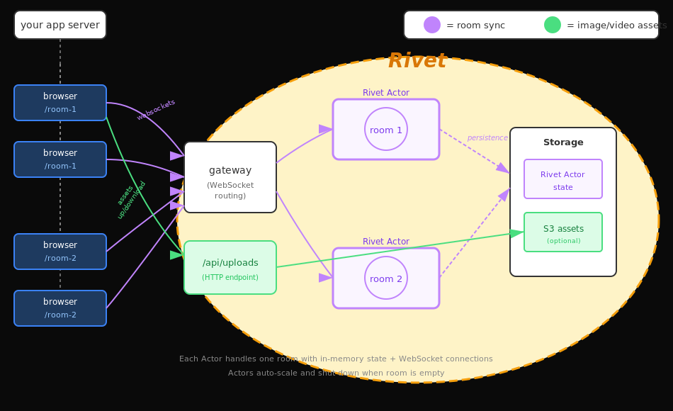

# tldraw sync server

This is a production-ready backend for [tldraw sync](https://tldraw.dev/docs/sync).

- Your client-side tldraw-based app can be served from anywhere you want.
<<<<<<< HEAD
- This backend uses [Cloudflare Workers](https://developers.cloudflare.com/workers/), and will need
  to be deployed to your own Cloudflare account.
- Each whiteboard is synced via
  [WebSockets](https://developer.mozilla.org/en-US/docs/Web/API/WebSockets_API) to a [Cloudflare
  Durable Object](https://developers.cloudflare.com/durable-objects/).
- Whiteboards and any uploaded images/videos are stored in a [Cloudflare
  R2](https://developers.cloudflare.com/r2/) bucket.
- Although unrelated to tldraw sync, this server also includes a component to fetch link previews
  for URLs added to the canvas.
  This is a minimal setup of the same system that powers multiplayer collaboration for hundreds of
  thousands of rooms & users on www.tldraw.com. Because durable objects effectively create a mini
  server instance for every single active room, we've never needed to worry about scale. Cloudflare
=======
- This backend uses [Rivet](https://www.rivet.dev/), and will need
  to be deployed to your cloud of choice. See see the
  [available deploy options](https://www.rivet.dev/docs/#deploy-options).
- Each whiteboard is synced via
  [WebSockets](https://developer.mozilla.org/en-US/docs/Web/API/WebSockets_API) to a [Rivet
  Actor](https://www.rivet.dev/docs/actors/).
- Whiteboards and any uploaded images/videos are stored in a [S3](https://aws.amazon.com/s3/)
  bucket (if configured).
- Although unrelated to tldraw sync, this server also includes a component to fetch link previews
  for URLs added to the canvas.
  This is a minimal setup of the same system that powers multiplayer collaboration for hundreds of
  thousands of rooms & users on www.tldraw.com. Because actors effectively create a mini
  server instance for every single active room, we've never needed to worry about scale. Rivet
>>>>>>> 53c94df90 (init rivet support)
  handles the tricky infrastructure work of ensuring there's only ever one instance of each room, and
  making sure that every user gets connected to that instance. We've found that with this approach,
  each room is able to handle about 50 simultaneous collaborators.

## Overview

<<<<<<< HEAD

When a user opens a room, they connect via Workers to a durable object. Each durable object is like
its own miniature server. There's only ever one for each room, and all the users of that room
connect to it. When a user makes a change to the drawing, it's sent via a websocket connection to
the durable object for that room. The durable object applies the change to its in-memory copy of the
document, and broadcasts the change via websockets to all other connected clients. On a regular
schedule, the durable object persists its contents to an R2 bucket. When the last client leaves the
room, the durable object will shut down.

Static assets like images and videos are too big to be synced via websockets and a durable object.
Instead, they're uploaded to workers which store them in the same R2 bucket as the rooms. When
they're downloaded, they're cached on cloudflare's edge network to reduce costs and make serving
them faster.
=======

When a user opens a room, they connect to a Rivet Actor. Each Rivet Actor is like
its own miniature server. There's only ever one for each room, and all the users of that room
connect to it. When a user makes a change to the drawing, it's sent via a websocket connection to
the actor for that room. The actor applies the change to its in-memory copy of the
document, and broadcasts the change via websockets to all other connected clients. On a regular
schedule, the actor's content gets persisted to Rivet's storage mechanism. When the last client leaves the
room, the actor will shut down.

Static assets like images and videos are too big to be synced via websockets and an actor.
Instead, they're uploaded to S3 using presigned requests.
>>>>>>> 53c94df90 (init rivet support)

## Development

To install dependencies, run `yarn`. To start a local development server, run `yarn dev`. This will
<<<<<<< HEAD
start a [`vite`](https://vitejs.dev/) dev server running both your application frontend, and the
cloudflare workers backend via the [cloudflare vite
plugin](https://developers.cloudflare.com/workers/vite-plugin/). The app & server should now be
running at http://localhost:5137.

The backend worker is under [`worker`](./worker/), and is split across several files:

- **[`worker/worker.ts`](./worker/worker.ts):** the main entrypoint to the worker, defining each
  route available.
- **[`worker/TldrawDurableObject.ts`](./worker/TldrawDurableObject.ts):** the sync durable object.
  An instance of this is created for every active room. This exposes a
  [`TLSocketRoom`](https://tldraw.dev/reference/sync-core/TLSocketRoom) over websockets, and
  periodically saves room data to R2.
- **[`worker/assetUploads.ts`](./worker/assetUploads.ts):** uploads, downloads, and caching for
  static assets like images and videos.
- **[`worker/bookmarkUnfurling.ts`](./worker/bookmarkUnfurling.ts):** extract URL metadata for bookmark shapes.
=======
start a [`vite`](https://vitejs.dev/) for the frontend and a RivetKit
development server for the backend. The app & server should now be running at
http://localhost:5137.

The backend server is under [`server`](./server/), and is split across several files:

- **[`server/registry.ts`](./server/registry.ts):** defines the tldraw actor and sets up the Rivet registry.
  This creates a [`TLSocketRoom`](https://tldraw.dev/reference/sync-core/TLSocketRoom) for each active room
  and handles WebSocket connections.
- **[`server/server.ts`](./server/server.ts):** the main entrypoint that starts the Rivet registry with
  CORS configuration.
>>>>>>> 53c94df90 (init rivet support)

The frontend client is under [`client`](./client):

- **[`client/App.tsx`](./client/App.tsx):** the main client `<App />` component. This connects our
  sync backend to the `<Tldraw />` component, wiring in assets and bookmark previews.
- **[`client/multiplayerAssetStore.tsx`](./client/multiplayerAssetStore.tsx):** how does the client
  upload and retrieve assets like images & videos from the worker?
- **[`client/getBookmarkPreview.tsx`](./client/getBookmarkPreview.tsx):** how does the client fetch
  bookmark previews from the worker?

<<<<<<< HEAD
  ## Custom shapes

To add support for custom shapes, see the [tldraw sync custom shapes docs](https://tldraw.dev/docs/sync#Custom-shapes--bindings).

## Adding cloudflare to your own repo
=======
## Custom shapes

To add support for custom shapes, see the [tldraw sync custom shapes docs](https://tldraw.dev/docs/sync#Custom-shapes--bindings).

## Adding Rivet to your own repo
>>>>>>> 53c94df90 (init rivet support)

If you already have an app using tldraw and want to use the system in this repo, you can copy and
paste the relevant parts to your own app.

<<<<<<< HEAD
To add the server to your own app, copy the contents of the [`worker`](./worker/) folder and
[`./wrangler.toml`](./wrangler.toml) into your app. Add the dependencies from
[`package.json`](./package.json). You can run the worker using `wrangler dev` in the same folder as
`./wrangler.toml`.
=======
To add the server to your own app, copy the contents of the [`server`](./server/) folder into your app.
Add the dependencies from [`package.json`](./package.json). You can run the server using `yarn dev` or
by following the [Rivet deployment documentation](https://www.rivet.dev/docs/).
>>>>>>> 53c94df90 (init rivet support)

To point your existing client at the server defined in this repo, copy
[`client/multiplayerAssetStore.tsx`](./client/multiplayerAssetStore.tsx) and
[`client/getBookmarkPreview.tsx`](./client/getBookmarkPreview.tsx) into your app. Then, adapt the
code from [`client/App.tsx`](./client/App.tsx) to your own app. Adapt the `/api/` URLs used in each
of these files to point at your new `wrangler dev` server.

## Deployment

To deploy this example, you'll need to create a cloudflare account and create an R2 bucket to store
your data. Update `bucket_name = 'tldraw-content'` in [`wrangler.toml`](./wrangler.toml) with the
name of your new bucket.

To actually deploy the app, first create a production build using `yarn build`. Then, run `yarn
wrangler deploy`. This will deploy the backend worker along with the frontend app to cloudflare.
This should give you a workers.dev URL, but you can also [configure a custom
domain](https://developers.cloudflare.com/workers/configuration/routing/custom-domains/).

## License

This project is provided under the MIT license found [here](https://github.com/tldraw/tldraw-sync-cloudflare/blob/main/LICENSE.md). The tldraw SDK is provided under the [tldraw license](https://github.com/tldraw/tldraw/blob/main/LICENSE.md).

## Trademarks

Copyright (c) 2024-present tldraw Inc. The tldraw name and logo are trademarks of tldraw. Please see our [trademark guidelines](https://github.com/tldraw/tldraw/blob/main/TRADEMARKS.md) for info on acceptable usage.

## Distributions

You can find tldraw on npm [here](https://www.npmjs.com/package/@tldraw/tldraw?activeTab=versions).

## Contribution

Please see our [contributing guide](https://github.com/tldraw/tldraw/blob/main/CONTRIBUTING.md). Found a bug? Please [submit an issue](https://github.com/tldraw/tldraw/issues/new).

## Community

Have questions, comments or feedback? [Join our discord](https://discord.tldraw.com/?utm_source=github&utm_medium=readme&utm_campaign=sociallink). For the latest news and release notes, visit [tldraw.dev](https://tldraw.dev).

## Contact

Find us on Twitter/X at [@tldraw](https://twitter.com/tldraw).
